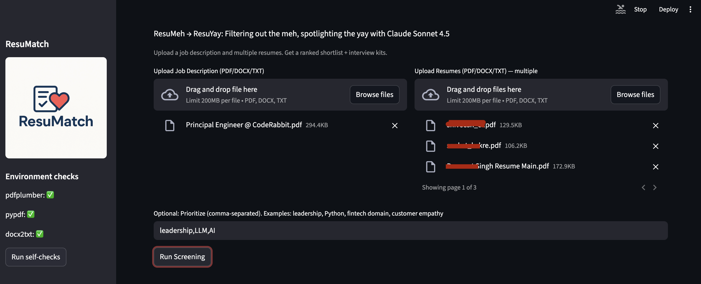
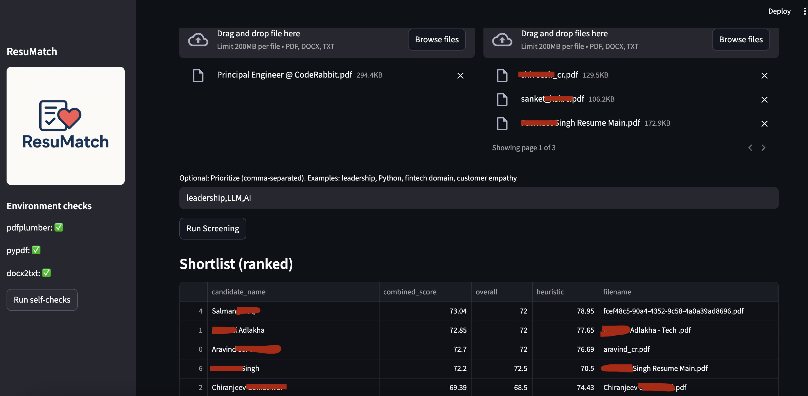
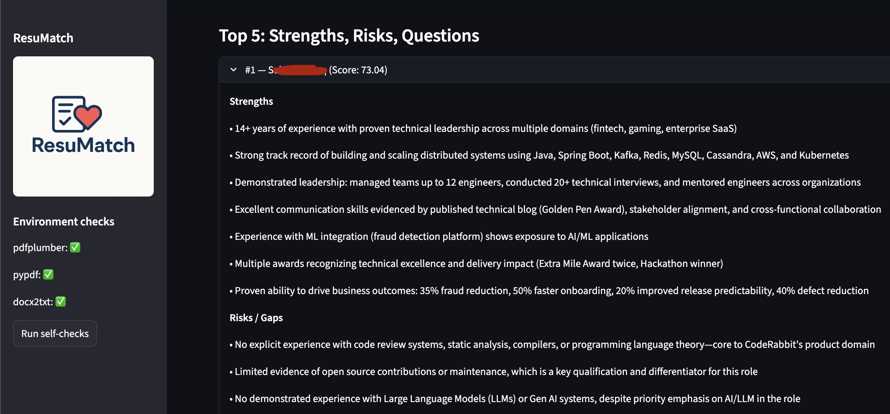
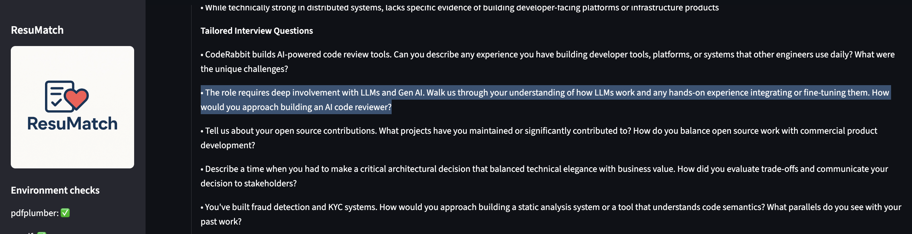

# ResuMatch

ResuMatch is your friendly neighborhood recruiter's co-pilot! Go from *ResuMeh* to *ResuYay*: Filter out the meh, spotlight the yay with **Claude Sonnet 4.5**

## Run

```sh
$ python3 -m venv venv
$ source venv/bin/activate
$ python3 -m pip install -r requirements.txt
$ export ANTHROPIC_API_KEY=xxx
$ streamlit run app.py
```

## Hackathon submission

This is an entry for [Accel + Anthropic Dev Day](https://accel-anthropic-ai-dev-day.devpost.com/)
hackathon under the *HR* category.

#### Description

ResuMatch takes a job description and a pile of resumes and turns them into a
ranked, no-nonsense shortlist. It’s for recruiters and hiring managers who need
a fast first pass without losing the "why."

How it works: you upload a JD and a bunch of resumes. ResuMatch scores each
candidate on five simple things—role fit, core skills, seniority, domain match,
communication—then shows strengths, risks, and a few tailored interview
questions. If priorities change, just say so ("prioritize leadership and fintech")
and it re-scores on the spot.

How we use Claude: the app sends the JD and each resume to **Claude Sonnet 4.5**,
which evaluates against the rubric and returns a small JSON payload we use for
ranking and the UI. Sonnet’s long context helps with multi-page resumes and
detailed JDs, and its reasoning keeps the feedback specific ("strong Python +
payments, light on team leadership"). We also ask Claude to ignore demographic
details and to call out when information is missing rather than guessing. Claude
Code CLI was extensively used to iterate on the code implementation.

Exports go to CSV/Sheets, and it’s easy to plug into an ATS later.

#### Demo





